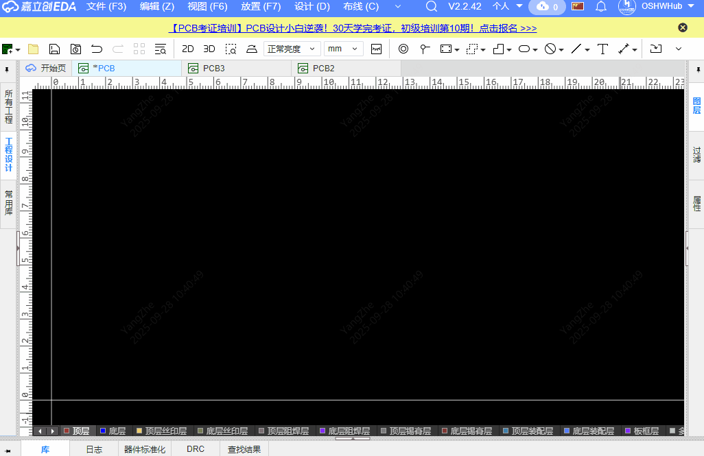
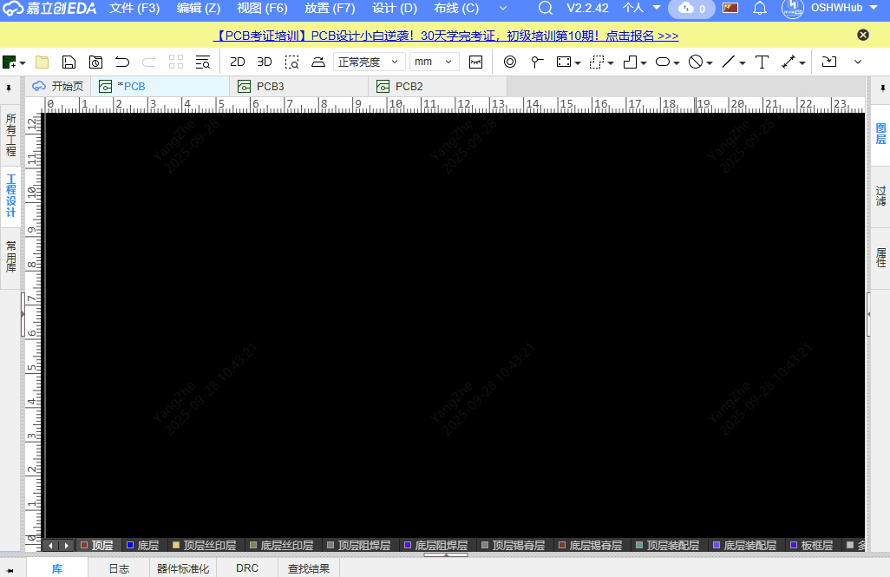
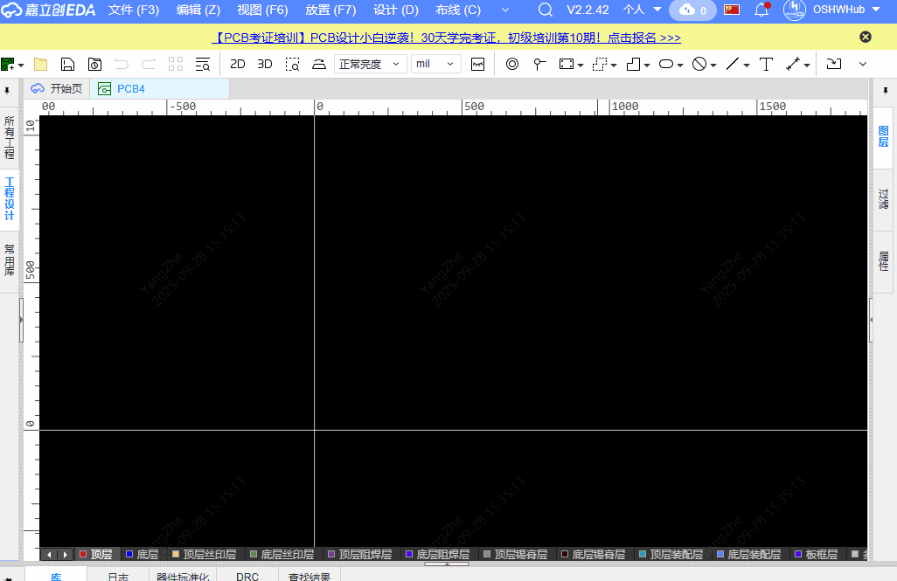

[中文](./README.md)

# QR Code / Barcode Silkscreen Generator

This is a plugin tool for generating QR codes and barcodes in JLCPCB EDA.

## Features

This plugin provides the following features:

1. **QR Code Generation** - Generate QR codes from text, URLs, and other content
   

2. **Barcode Generation** - Supports generating standard barcodes
   

3. **Image Import** - Supports importing QR codes or barcodes from existing image files
   

4. **Custom Size** - Set the size of the generated image (unit: millimeters)
5. **Color Generation** - Supports generating colored QR codes and barcodes

## Usage

### Generate QR Code / Barcode

1. In the JLCPCB EDA PCB editor, click "QR Code Generator" → "Generate" in the menu bar
2. Enter the content to be encoded in the popup window
3. Click the "QR Code" or "Barcode" button to generate the corresponding code
4. You can set the image width (millimeters) and color options
5. Click "Download" to save locally, or click "Place" to place the code on the PCB

### Import from Image

1. In the JLCPCB EDA PCB editor, click "QR Code Generator" → "Import from Image" in the menu bar
2. Select a local QR code or barcode image
3. Confirm the import and place it on the PCB

## Dependencies

This plugin is developed based on the following open source libraries:

- [pro-api-sdk](https://github.com/easyeda/pro-api-sdk) - Official JLCPCB API SDK for building and developing extensions
- [qrcode.js](https://github.com/davidshimjs/qrcodejs) - For generating QR codes
- [JsBarcode](https://github.com/lindell/JsBarcode) - For generating barcodes

