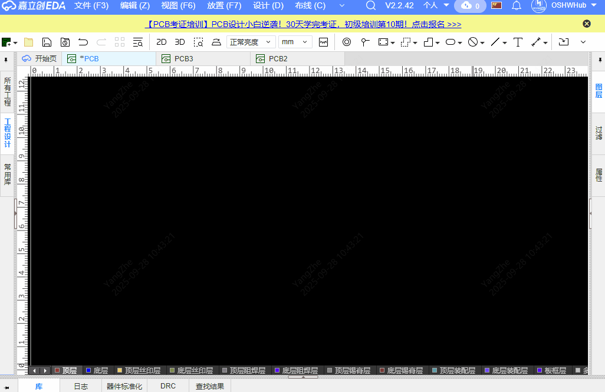
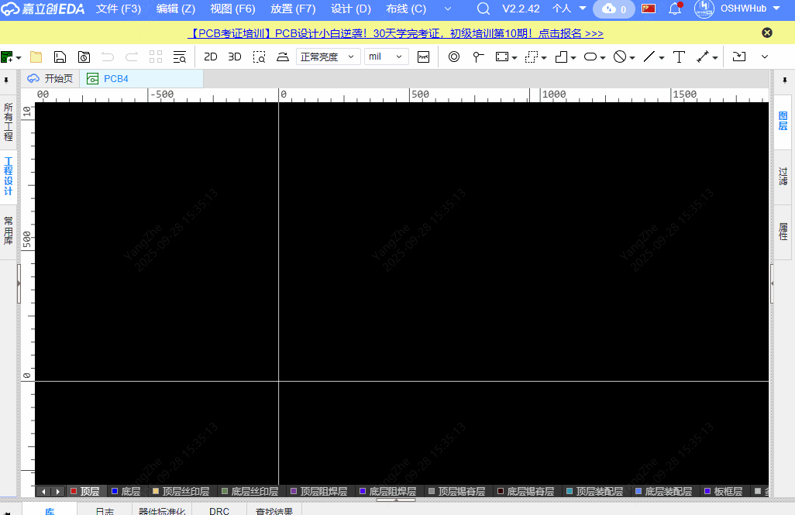

# 二维码/条形码丝印生成工具

这是一个用于在嘉立创EDA中生成二维码和条形码的插件工具。

## 功能介绍

该插件提供了以下功能：

1. **二维码生成** - 可以将文本、URL等内容生成二维码  
   

2. **条形码生成** - 支持生成标准条形码  
   

3. **图片导入** - 支持从现有图片文件导入二维码或条形码  
   

4. **自定义尺寸** - 可设置生成图片的尺寸大小（单位：毫米）  
5. **彩色生成** - 支持生成彩色的二维码和条形码  

## 使用方法

### 生成二维码/条形码

1. 在嘉立创EDA的PCB编辑器中，点击菜单栏的"二维码生成" → "生成"
2. 在弹出的窗口中输入需要编码的内容
3. 点击"二维码"或"条形码"按钮生成对应码
4. 可设置图片宽度（毫米）和颜色选项
5. 点击"下载"保存到本地，或点击"放置"将码放置到PCB上

### 从图片导入

1. 在嘉立创EDA的PCB编辑器中，点击菜单栏的"二维码生成" → "从图片导入"
2. 选择本地的二维码或条形码图片
3. 确认导入并放置到PCB上

## 特性

- 支持自定义尺寸（以毫米为单位）
- 支持生成彩色二维码/条形码
- 支持指定放置坐标
- 可直接下载生成的图片
- 可直接将生成的码放置到PCB设计中

## 技术说明

本插件基于以下开源库开发：

- [pro-api-sdk](https://github.com/easyeda/pro-api-sdk) - 嘉立创官方API SDK 用于构建与开发拓展
- [qrcode.js](https://github.com/davidshimjs/qrcodejs) - 用于生成二维码
- [JsBarcode](https://github.com/lindell/JsBarcode) - 用于生成条形码

## 安装

该插件可在嘉立创EDA的插件市场中直接安装。

## 使用要求

- 嘉立创EDA版本 >= 2.3.0

## 许可证

本项目采用Apache-2.0许可证，详情请见[LICENSE](LICENSE)文件。

